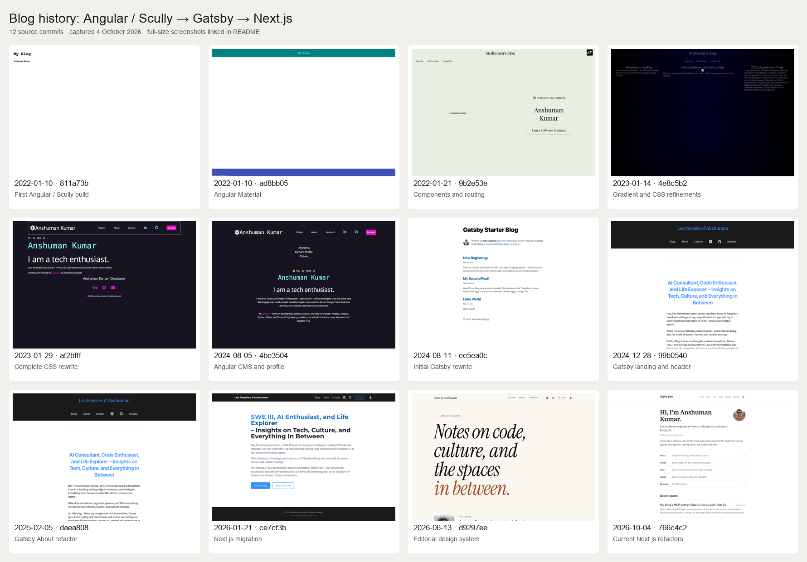

# Blog build history

41 full-page screenshots from 12 source commits, captured on 4 October 2026. Desktop viewport: 1440 × 1000; mobile viewport: 390 × 844. Full-page images can be taller than the viewport.

## Screenshots

| Date | Milestone | Source commit | Home | Additional pages |
| --- | --- | --- | --- | --- |
| 2022-01-10 | First successful Angular / Scully build | [`811a73b`](https://github.com/anshumankmr/myblog/commit/811a73b9227c9e771066afdd89f33c368a8a2c86) | [desktop](2022-01-10-angular-scully-first-build-home-desktop.png) · [mobile](2022-01-10-angular-scully-first-build-home-mobile.png) | — |
| 2022-01-10 | First Angular Material build | [`ad8bb05`](https://github.com/anshumankmr/myblog/commit/ad8bb05a5447b876494b708513bdf881cc04843e) | [desktop](2022-01-10-angular-material-home-desktop.png) · [mobile](2022-01-10-angular-material-home-mobile.png) | — |
| 2022-01-21 | Header, footer, routing, and About component refactor | [`9b2e53e`](https://github.com/anshumankmr/myblog/commit/9b2e53e7418ccd0e15db16a29e1710d13d726dee) | [desktop](2022-01-21-angular-component-refactor-home-desktop.png) · [mobile](2022-01-21-angular-component-refactor-home-mobile.png) | — |
| 2023-01-14 | Gradient and CSS refinements | [`4e8c5b2`](https://github.com/anshumankmr/myblog/commit/4e8c5b23298d8d4d8e7544e0edf053722698dda5) | [desktop](2023-01-14-angular-gradient-css-home-desktop.png) · [mobile](2023-01-14-angular-gradient-css-home-mobile.png) | — |
| 2023-01-29 | Complete CSS rewrite | [`af2bfff`](https://github.com/anshumankmr/myblog/commit/af2bfff2e79a7a13de454a1aa516c61b921135a8) | [desktop](2023-01-29-angular-css-rewrite-home-desktop.png) · [mobile](2023-01-29-angular-css-rewrite-home-mobile.png) | — |
| 2024-08-05 | Final Angular / Scully version with CMS and profile photo | [`4be3504`](https://github.com/anshumankmr/myblog/commit/4be3504bed45b9a682482cb3000f93779d1a10f5) | [desktop](2024-08-05-angular-cms-profile-home-desktop.png) · [mobile](2024-08-05-angular-cms-profile-home-mobile.png) | About: [desktop](2024-08-05-angular-cms-profile-about-desktop.png) · [mobile](2024-08-05-angular-cms-profile-about-mobile.png); Blogs: [desktop](2024-08-05-angular-cms-profile-blogs-desktop.png) · [mobile](2024-08-05-angular-cms-profile-blogs-mobile.png) |
| 2024-08-11 | Initial Gatsby rewrite | [`ee5ea0c`](https://github.com/anshumankmr/myblog/commit/ee5ea0c82c22d75e3ddeba66facfa09db09b3d64) | [desktop](2024-08-11-gatsby-first-build-home-desktop.png) · [mobile](2024-08-11-gatsby-first-build-home-mobile.png) | — |
| 2024-12-28 | Gatsby landing page, header, and contact rewrite | [`99b0540`](https://github.com/anshumankmr/myblog/commit/99b054086aa6dfbed157363b7feb17c0f0e084d0) | [desktop](2024-12-28-gatsby-landing-header-home-desktop.png) · [mobile](2024-12-28-gatsby-landing-header-home-mobile.png) | About: [desktop](2024-12-28-gatsby-landing-header-about-desktop.png) · [mobile](2024-12-28-gatsby-landing-header-about-mobile.png) |
| 2025-02-05 | Gatsby About layout and resume refactors | [`daea808`](https://github.com/anshumankmr/myblog/commit/daea80859fd2cb29fb3076ee11cd751380aee1f9) | [desktop](2025-02-05-gatsby-about-refactor-home-desktop.png) · [mobile](2025-02-05-gatsby-about-refactor-home-mobile.png) | About: [desktop](2025-02-05-gatsby-about-refactor-about-desktop.png) · [mobile](2025-02-05-gatsby-about-refactor-about-mobile.png) |
| 2026-01-21 | Next.js 15 migration with dark mode | [`ce7cf3b`](https://github.com/anshumankmr/myblog/commit/ce7cf3ba43b38b045d6f87dcc15c7e234c7365f3) | [desktop](2026-01-21-nextjs-migration-home-desktop.png) · [mobile](2026-01-21-nextjs-migration-home-mobile.png) · [dark](2026-01-21-nextjs-migration-home-desktop-dark.png) | About: [desktop](2026-01-21-nextjs-migration-about-desktop.png) · [mobile](2026-01-21-nextjs-migration-about-mobile.png) |
| 2026-06-13 | Editorial design system and header refactor | [`d9297ee`](https://github.com/anshumankmr/myblog/commit/d9297ee365fded499f5920cb571589d422f5f08b) | [desktop](2026-06-13-nextjs-editorial-design-home-desktop.png) · [mobile](2026-06-13-nextjs-editorial-design-home-mobile.png) · [dark](2026-06-13-nextjs-editorial-design-home-desktop-dark.png) | About: [desktop](2026-06-13-nextjs-editorial-design-about-desktop.png) · [mobile](2026-06-13-nextjs-editorial-design-about-mobile.png) |
| 2026-10-04 | Current Next.js version after content, notes, SEO, and identity refactors | [`766c4c2`](https://github.com/anshumankmr/myblog/commit/766c4c2454d594f118ae7344532da29edc1abe8d) | [desktop](2026-10-04-nextjs-current-home-desktop.png) · [mobile](2026-10-04-nextjs-current-home-mobile.png) · [dark](2026-10-04-nextjs-current-home-desktop-dark.png) | About: [desktop](2026-10-04-nextjs-current-about-desktop.png) · [mobile](2026-10-04-nextjs-current-about-mobile.png) |

## Capture notes

- These are local reconstructions of the source commits. Post text comes from the current CMS legacy payload, filtered to publication dates on or before each commit. The live feed was verified to match the local content repository.
- The first successful Angular build was prerendered with Scully. Other Angular screenshots use compiled Angular development builds; Gatsby and Next.js screenshots use their production static builds.
- Retired CMS endpoints are redirected only during capture. Gatsby needed temporary RSS slug and image-encoding compatibility fixes. Dependency versions and temporary source patches are documented in [manifest.json](manifest.json).
- The 2022-01-21, 2023-01-14, and 2024-08-05 Angular pages refer to retired Google Cloud images that return 404. Their missing-image placeholders are preserved. Later captures use available Git portraits where documented.
- Website Carbon does not return a rating for these localhost pages; its badge displays “No Result.” Strava embeds, copyright dates, and external services render their current responses.
- Every captured page returned HTTP 200, and the final captures have no uncaught page errors. PNG dimensions and SHA-256 hashes are recorded in the manifest.

This directory contains screenshot assets and their index. It is nested under `content/` so the existing post generator continues to read only the published Markdown files at the top level.
